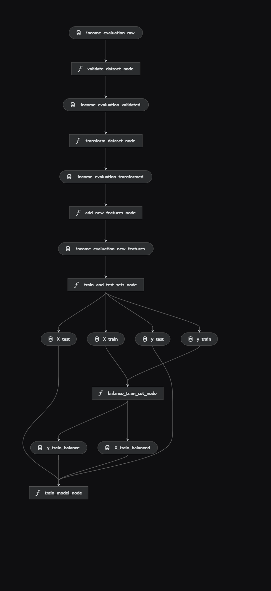

# income_evaluation

## Pipeline

Projekt zawiera jeden pipline.
Konfiguracja w .env

GOOGLE_CREDENTIALS - ścieżka do pliku json który zawiera autoryzację do konta usuług
UPLOAD_MODEL - ustawione na true zapisuje model w zio na koncie usług

### validate_dataset_node -> walidacja datasetu
Sprawdznie czy jest oczekiwana liczba kolumn, jeżeli nie ma to przerwanie pipleine
czy są oczekiwane nazwy kolumn, jeżeli nie ma to przerwanie pipleine
czy są nulowe wartości w wierszach, jeżeli są to przerwanie pipleine
czy są puste wartości w wierszach, jeżeli są to przerwanie pipleine

### transform_dataset_node -> transformacja danych
Usuwa spacje z nazw kolumn.
Usuwa niepotrzebne kolumny ze zbioru danych 'capital-loss', 'capital-gain', 'education-num', 'fnlwgt'.
Transformuje kolumnę z etykietą celu (income) do formatu binarnego (np. <=50K → False, >50K → True).
Zmienia nazwę kolumny zawierającej kraj pochodzenia na bardziej jednoznaczną (np. native-country → country_of_birth).
Usuwa nadmiarowe spacje z wartości w komórkach.
Zamienia znaki zapytania '?' na Unknown.

### add_new_features_node
Dodaje nową ceche kontynent na który jest położony dany kraj (chyba, że to USA to wtedy zostaje USA -> zrobiłem tak poniważ osób z USA jest najwięcej -> do dyskusji).

### train_and_test_sets_node
Stworzenie plików treningowych i testowych.

### train_model_node
Tranowanie modelu za pomocą autogluon na standordowych ustawieniach i zapis na chmurę google (jeżeli opcja UPLOAD_MODEL jest włączona)
Raport klasyfikacji:
               precision    recall  f1-score   support

       False     0.8660    0.9062    0.8856      4927
        True     0.6595    0.5643    0.6082      1586

    accuracy                         0.8230      6513
   macro avg     0.7628    0.7353    0.7469      6513
weighted avg     0.8157    0.8230    0.8181      6513

### Uruchomienie 
kedro run (testowane tylko na Windows)

### Do dodania
Zbalanoswanie danych -> do dyskusji

## skrypt tools/test
Funkcja download_model w tools/test to ptzykład jak ściągnąć najnowszy model z konta usług i go wczytać.
Po wczytaniu jest gotowy do użycia.